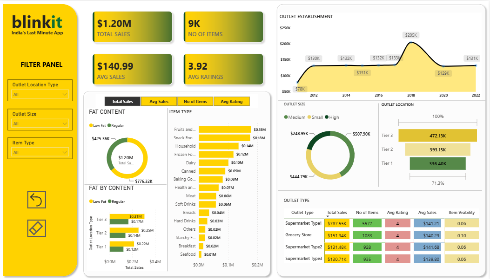

# Blinkit Sales Performance Analysis (End-to-End Power BI Project)

## 📊 Dashboard Preview

## 🎯 Project Overview
This project delivers a comprehensive, data-driven analysis of Blinkit's sales performance, customer satisfaction, and inventory distribution across various outlet tiers and sizes. The final dynamic dashboard enables stakeholders to deep-dive into critical operational metrics and identify strategic growth opportunities.

## 📂 Dataset Source & Nature
This is an independent portfolio case study built using public retail/grocery datasets to demonstrate end-to-end business intelligence development, data modeling, and advanced DAX principles.

## 💼 Business Requirements & KPIs Developed
* **Total Sales:** Tracked overall revenue across all grocery items ($1.20M).
* **Average Sales:** Calculated the average revenue generated per transaction ($141).
* **Item Count:** Tracked total volume of inventory items sold (8,523 items).
* **Average Rating:** Monitored customer satisfaction metrics (Current average: 3.9/5.0).

## 🛠️ Tech Stack & Data Engineering Process
1. **Data Gathering & Cleaning:** Connected raw Excel transaction data to Power Query. Handled data typing anomalies, rectified mismatched categorical strings (e.g., mapping `LF`/`low fat` discrepancies into unified dimensions), and evaluated data quality flags (100% valid dimensions).
2. **Dynamic Metrics Selection:** Developed a custom Field Parameter mapping DAX functions dynamically, enabling users to seamlessly toggle entire visuals between `Total Sales`, `Average Sales`, `Number of Items`, and `Average Rating`.
3. **Advanced Interactivity:** Refactored Power BI's standard "Highlighting" features into hard "Filter interactions" across all charts to prevent visual clutter and deliver absolute data subsets upon selection.

## 💡 Analytical Insights Discovered
* **Outlet Tier Impact:** Tier 3 locations drive the highest total sales volume, followed sequentially by Tier 2 and Tier 1 markets.
* **Size Optimization:** Medium-sized outlets dramatically outperform large/high-capacity or small configurations in revenue generation.
* **Product Demand:** Fruits, Vegetables, and Snack Foods represent the primary volume drivers, whereas Household items maintain the highest average sales price per order.
